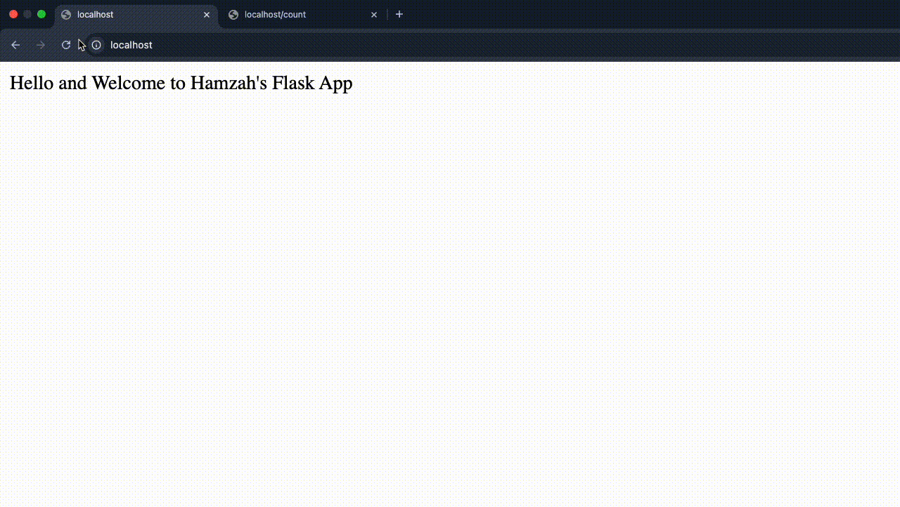

# Flask App with Redis and Docker Compose

This project demonstrates a multi-container application using a Python Flask web application and a Redis database, orchestrated with Docker Compose. The Flask application utilises Redis to store and retrieve a visitor count, providing a practical example of state management in a microservices architecture. 

All the files created for this project are located in the [docker-challenge](.) directory.

## Table of Contents

* [Objective](#objective)
* [Requirements](#requirements)
* [Project Files](#project-files)
* [Project Setup](#project-setup)
* [Dockerfile Configuration Breakdown](#dockerfile-configuration-breakdown)
* [docker-compose.yml Breakdown (Initial Setup with Port Mapping)](#docker-composeyml-breakdown-initial-setup-with-port-mapping)
* [flask-app.py Breakdown](#flask-apppy-breakdown)
* [Testing the Initial Configuration](#testing-the-initial-configuration)
* [Integrating Nginx for Load Balancing](#integrating-nginx-for-load-balancing)
* [Final Testing with Nginx](#final-testing-with-nginx)
* [Conclusion](#conclusion)

## Objective

Create a multi-container application consisting of a simple Python Flask web application and a Redis database. The Flask application should use Redis to store and retrieve data.

## Requirements

* **Flask Web Application:**
    * A Flask app that has two routes:
        * `/`: Displays a welcome message.
        * `/count`: Increments and displays a visit count stored in Redis.
* **Redis Database:**
    * Use Redis as a key-value store to keep track of the visit count.
    * Configure Redis to use a volume to persist its data.
* **Dockerize Both Services:**
    * Create Dockerfiles for both the Flask app and Redis.
    * Use Docker Compose to manage the multi-container application.
    * Modify the Flask application to read Redis connection details from environment variables and update the `docker-compose.yml` accordingly.
    * Scale the Flask service to run multiple instances and load balance between them using Docker Compose.
* **Testing:**
    * Access the Welcome Page: Open your browser and go to `http://localhost` to see the welcome message.
    * Test the Visit Count: Navigate to `http://localhost/count` to see the visit count increment each time you refresh the page.

## Project Files

* [Dockerfile](Dockerfile)
* [flask-app.py](flask-app.py)
* [docker-compose.yml](docker-compose.yml)
* [nginx.conf](nginx.conf)

## Project Setup

Before diving into the Docker configuration, we need to set up our project directory and create the necessary files.

1.  **Create Project Directory:**

    ```bash
    mkdir flask-redis-app
    cd flask-redis-app
    ```

2.  **Create Files:**

    Create the following files in your project directory:

    * `Dockerfile`
    * `flask-app.py`
    * `docker-compose.yml`
    * `nginx.conf`

    You can create these files using your preferred text editor or the `touch` command:

    ```bash
    touch Dockerfile flask-app.py docker-compose.yml nginx.conf
    ```

## Dockerfile Breakdown

The `Dockerfile` is used to build the Docker image for the Flask application. Here's a step-by-step breakdown of its configuration:

1.  **Base Image:**

    ```dockerfile
    FROM python:3.12-slim
    ```

    * This line specifies the base image for our Docker build. We're using the official Python 3.12 slim image from Docker Hub. This image provides a minimal Debian-based environment with Python 3.12 pre-installed. Using the slim version reduces the image size.

2.  **Working Directory:**

    ```dockerfile
    WORKDIR /app
    ```

    * This sets the working directory inside the container to `/app`. All subsequent commands will be executed from this directory.

3.  **Copy Application Files:**

    ```dockerfile
    COPY . /app
    ```

    * This line copies all files and directories from the current directory (where the `Dockerfile` is located) to the `/app` directory inside the container. This includes your `flask-app.py` file and any other necessary files.

4.  **Install Dependencies:**

    ```dockerfile
    RUN pip install flask redis
    ```

    * This command uses `pip`, the Python package installer, to install the Flask and Redis libraries. These are the dependencies required by our Flask application.

5.  **Expose Port:**

    ```dockerfile
    EXPOSE 5002
    ```

    * This line informs Docker that the container will listen on port 5002 at runtime. Note that this does not publish the port to the host machine; it only documents the port.

6.  **Command to Run the Application:**

    ```dockerfile
    CMD ["python", "flask-app.py"]
    ```

    * This line specifies the command that will be executed when the container starts. In this case, it runs the `flask-app.py` script using the Python interpreter.

## docker-compose.yml Breakdown (Initial Setup with Port Mapping)

The `docker-compose.yml` file defines and manages the services in our application. In this initial setup, we'll focus on the Flask app and Redis services, and add a port mapping to the web-app for direct testing.

1.  **Services Definition:**

    ```yaml
    services:
    ```

    * This section defines the services that will be run by Docker Compose.

2.  **Flask App Service (`web-app`):**

    ```yaml
    web-app:
      build: .
      ports:
        - "5002:5002"
      depends_on:
        - redis-db
      environment:
        - REDIS_HOST=redis-db
        - REDIS_PORT=6379
    ```

    * `web-app`: This is the name of our Flask application service.
    * `build: .`: This tells Docker Compose to build the image for this service using the `Dockerfile` in the current directory.
    * `ports: - "5002:5002"`: This line maps port 5002 on the host machine to port 5002 in the container, allowing you to access the Flask app directly from your browser.
    * `depends_on: - redis-db`: This ensures that the Redis service (`redis-db`) is started before the Flask app service.
    * `environment:`: This section defines environment variables that will be passed to the Flask app container.
        * `REDIS_HOST=redis-db`: Sets the Redis host to `redis-db`, which is the service name of our Redis container. Docker Compose's internal DNS will resolve this to the correct IP address.
        * `REDIS_PORT=6379`: Sets the Redis port to `6379`, the default Redis port.

3.  **Redis Service (`redis-db`):**

    ```yaml
    redis-db:
      image: redis:alpine
      volumes:
        - redis_data:/data
    ```

    * `redis-db`: This is the name of our Redis service.
    * `image: redis:alpine`: This specifies that we're using the official Redis Alpine image from Docker Hub.
    * `volumes: - redis_data:/data`: This mounts a Docker volume named `redis_data` to the `/data` directory inside the Redis container. This ensures that Redis data is persisted even if the container is stopped or removed.

4.  **Volumes Definition:**

    ```yaml
    volumes:
      redis_data:
    ```

    * `volumes: redis_data:`: This defines a named volume called `redis_data` that is used by the Redis service for data persistence.

**Purpose:**

This `docker-compose.yml` file sets up a basic multi-container application with a Flask app and a Redis database. It defines the services, their dependencies, environment variables, and volumes for data persistence. The inclusion of the port mapping on the `web-app` service allows for direct access to the Flask application from the host machine, facilitating initial testing and verification of the application's functionality.

## flask-app.py Breakdown

The `flask-app.py` file contains the Python code for our Flask web application. Here's a breakdown of its functionality:

1.  **Import Libraries:**

    ```python
    import os
    from flask import Flask
    import redis
    ```

    * `os`: Used to access environment variables.
    * `Flask`: The Flask web framework.
    * `redis`: The Redis Python client library.

2.  **Create Flask App Instance:**

    ```python
    app = Flask(__name__)
    ```

    * This line creates an instance of the Flask application.

3.  **Retrieve Redis Connection Details from Environment Variables:**

    ```python
    r_host = os.getenv('REDIS_HOST', 'redis-db')
    r_port = int(os.getenv('REDIS_PORT', 6379))
    ```

    * `os.getenv('REDIS_HOST', 'redis-db')`: Retrieves the value of the `REDIS_HOST` environment variable. If the variable is not set, it defaults to `'redis-db'`.
    * `int(os.getenv('REDIS_PORT', 6379))`: Retrieves the value of the `REDIS_PORT` environment variable, converts it to an integer, and defaults to `6379` if the variable is not set.

4.  **Create Redis Client:**

    ```python
    r = redis.Redis(host=r_host, port=r_port)
    ```

    * This creates a Redis client object, using the host and port obtained from the environment variables.

5.  **Define Routes:**

    * **`/` Route (Welcome Message):**

        ```python
        @app.route("/")
        def welcome_message():
            count = r.incr("total_visitors")
            return "Hello and Welcome to Hamzah's Flask App"
        ```

        * This route displays a welcome message.
        * `r.incr("total_visitors")`: Increments the `total_visitors` key in Redis and returns the new value.

    * **`/count` Route (Visitor Count):**

        ```python
        @app.route("/count")
        def count():
            total = r.get("total_visitors")
            return f'Total Visitors: {int(total)}'
        ```

        * This route retrieves the visitor count from Redis and displays it.
        * `r.get("total_visitors")`: Retrieves the value of the `total_visitors` key from Redis.

6.  **Run the Flask App:**

    ```python
    if __name__ == "__main__":
        app.run(host="0.0.0.0", port=5002)
    ```

    * This block starts the Flask development server when the script is run directly.
    * `host="0.0.0.0"`: Makes the server listen on all available network interfaces.
    * `port=5002`: Specifies the port the server listens on.

## Testing the Initial Configuration

After setting up the `Dockerfile` and `docker-compose.yml` (with the port mapping), we can test the application to ensure the initial configuration is working as expected.

1.  **Start the Application:**

    Open your terminal and navigate to the directory containing your `docker-compose.yml` file. Run the following command:

    ```bash
    docker-compose up --build
    ```

    This command will build the Docker image for the Flask app and start both the Flask and Redis containers.

2.  **Access the Welcome Page:**

    Open your web browser and go to `http://localhost:5002`. You should see the welcome message: "Hello and Welcome to Hamzah's Flask App".

3.  **Test the Visitor Count:**

    Navigate to `http://localhost:5002/count`. You should see the visitor count displayed. Refresh the page multiple times, and you should observe the count incrementing with each refresh. This confirms that the Flask app is successfully communicating with the Redis database.

4.  **Stop the Application:**

    To stop the running containers, return to your terminal and press `Ctrl+C`. Then, run:

    ```bash
    docker-compose down
    ```

    This command will stop and remove the containers.

**Verification:**

These steps verify that:

* The Flask application container is running correctly.
* The Flask application is able to connect to the Redis database.
* The Redis database is persisting the visitor count.
* The port mapping is working, allowing you to access the Flask application from your host machine.

## Integrating Nginx for Load Balancing

To enhance our application and introduce load balancing, we'll integrate Nginx as a reverse proxy. This involves updating our `docker-compose.yml` file and creating an Nginx configuration file.

1.  **Update `docker-compose.yml`:**

    We need to add the Nginx service to our `docker-compose.yml` file. Here's the updated file:

    ```yaml
    services:
      web-app:
        build: .
        deploy:
          replicas: 3
        depends_on:
          - redis-db
        environment:
          - REDIS_HOST=redis-db
          - REDIS_PORT=6379

      redis-db:
        image: redis:alpine
        volumes:
          - redis_data:/data

      nginx:
        image: nginx:alpine
        ports:
          - "80:80"
        volumes:
          - ./nginx.conf:/etc/nginx/nginx.conf
        depends_on:
          - web-app

    volumes:
      redis_data:
    ```

    * **`nginx` Service:**
        * We've added a new service called `nginx`.
        * `image: nginx:alpine`: We're using the official Nginx Alpine image.
        * `ports: - "80:80"`: We're mapping port 80 on the host machine to port 80 in the Nginx container, allowing access via `http://localhost`.
        * `volumes: - ./nginx.conf:/etc/nginx/nginx.conf`: We're mounting our `nginx.conf` file into the Nginx container.
        * `depends_on: - web-app`: This ensures that the Flask app service (`web-app`) is started before Nginx.
        * `deploy: replicas: 3`: This line scales the web-app service to 3 instances.

2.  **Create `nginx.conf`:**

    Create a file named `nginx.conf` in the same directory as your `docker-compose.yml` file with the following content:

    ```nginx
    events {}

    http {
        upstream flask_app {
            server web-app:5002;
        }

        server {
            listen 80;

            location / {
                proxy_pass http://flask_app;
            }
        }
    }
    ```

    * **`upstream flask_app`:** Defines a group of backend servers (our Flask app instances).
    * **`server web-app:5002`:** Specifies the Flask app service and port. Docker Compose's internal DNS resolves `web-app` to the container IPs.
    * **`listen 80`:** Nginx listens on port 80.
    * **`proxy_pass http://flask_app`:** Forwards requests to the `flask_app` upstream group.

3.  **Remove Port Mapping from web-app:**

    In the original docker-compose file, we mapped port 5002 to the host machine. This needs to be removed. The web-app container should not be exposed to the host machine, and all traffic should go through Nginx.

4.  **Rebuild and Run:**

    ```bash
    docker-compose up --build
    ```

    This will rebuild the images and start the containers, including Nginx.

## Final Testing with Nginx

With Nginx integrated, we can now test the complete setup, including load balancing across multiple Flask app instances.

1.  **Start the Application:**

    If you haven't already, start the application using Docker Compose:

    ```bash
    docker-compose up --build
    ```

2.  **Access the Application via Nginx:**

    Open your web browser and go to `http://localhost`. You should see the welcome message. Note that we're now accessing the application through Nginx on port 80.

3.  **Test the Visitor Count:**

    Navigate to `http://localhost/count`. You should see the visitor count displayed. Refresh the page multiple times.

4.  **Verify Load Balancing:**

    To verify that Nginx is load balancing across the Flask app instances, you can:

    * **Check Container Logs:** Use `docker logs docker-challenge-web-app-1` (or 2, or 3) to view the logs of each Flask app container. You should see that the requests are being distributed among the containers.
    * **Docker Desktop:** Alternatively, you can open the Docker Desktop application and navigate to the "Containers" section. Here, you will be able to view all of the running containers and see the three instances of the web-app service running.

5.  **Stop the Application:**

    To stop the running containers, press `Ctrl+C` in your terminal, and then run:

    ```bash
    docker-compose down
    ```

**Verification:**

These steps verify that:

* Nginx is correctly routing requests to the Flask app instances.
* Load balancing is working as expected.
* The application is accessible through port 80 via Nginx.
* The Redis database is still persisting the visitor count.



## Conclusion

This project demonstrates how to build and scale a multi-container application using Docker Compose, Flask, Redis, and Nginx. We covered the process from setting up the initial application to implementing load balancing and ensuring data persistence. By leveraging Docker Compose, we simplified the orchestration of our services and created a scalable and robust application.