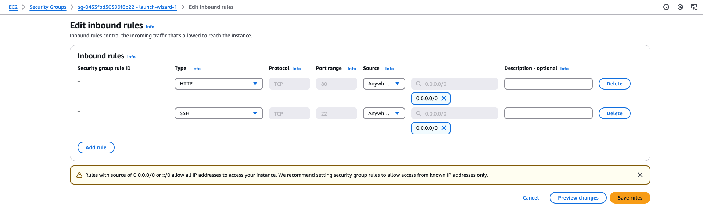
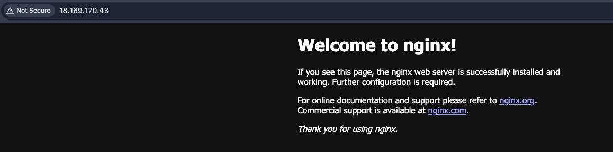
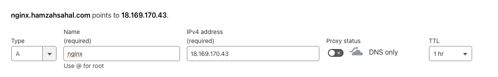
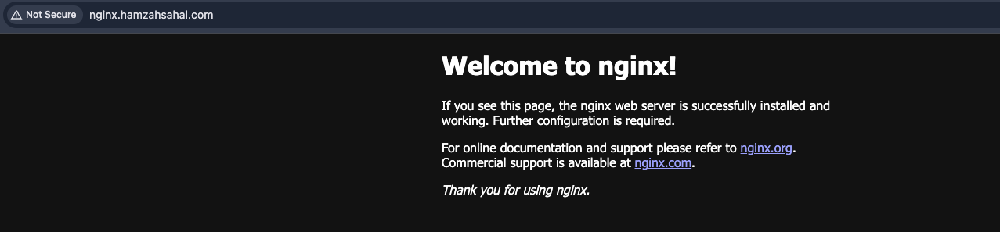
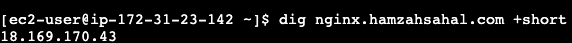

# NGINX on EC2 with User-Data and Custom Domain

## Introduction

In this mini-project, I’m combining my recent learnings of Networking, AWS, and Bash to run NGINX on an EC2 instance. Using EC2’s user-data feature, I automated the installation and configuration of NGINX. Additionally, I’ve pointed the server to a custom domain I created, making it accessible over the internet.

This project demonstrates how different technologies come together to build a functioning web server, providing a solid foundation for future DevOps and cloud-based applications.

## Steps

### 1. Configure Domain

The first thing I did was purchase a domain through Cloudflare, which allowed me to easily manage DNS settings and link it to my EC2 instance running NGINX. The domain name is **hamzahsahal.com**.

### 2. Create EC2 Instance

Next, I created an EC2 instance using the free tier resources and selected the Amazon Linux AMI to run the necessary software for hosting the website.

### 3. Configure User-Data Script

I then added all the required commands to a script, which I placed in the EC2 instance's user data. This script updated the instance’s packages `(sudo yum update -y)`, installed NGINX `(sudo yum install nginx -y)`, started the NGINX service `(sudo systemctl start nginx)`, and enabled it to automatically start on boot `(sudo systemctl enable nginx)`.

```bash
#!/bin/bash

sudo yum update -y

sudo yum install -y nginx

sudo systemctl enable nginx
sudo systemctl start nginx
```

### 4. Adjust Security Group

Next, I adjusted the security group generated for the EC2 instance to allow inbound traffic on **port 22** for **SSH** access and **port 80** for **HTTP** traffic, ensuring that the NGINX web server would be accessible via the browser.




### 5. Tested with Public IP

After waiting a few minutes for NGINX to complete its installation, I tested the setup by accessing the EC2 instance's public IP address in a web browser. This allowed me to confirm that NGINX was successfully running and serving the default NGINX welcome page.



### 6. Adding A Record to Cloudflare

Next, I added an **A record** in Cloudflare to point to the EC2 instance using its public IP address. I set the record up as `nginx.hamzahsahal.com`, which allowed me to access the NGINX server through my custom domain.



### 7. Testing with Custom Domain

After setting up the A record, I tested the custom domain `nginx.hamzahsahal.com` to ensure it was working correctly. After a brief wait for DNS propagation, I was able to access the NGINX default page through the domain, confirming that everything was set up properly.



### 8. Verifying DNS Configuration with dig Command

To confirm that the domain was correctly pointing to my EC2 instance, I used the command `dig nginx.hamzahsahal.com +short`. This returned the public IP address of my instance, verifying that the DNS setup was correct and the domain was properly resolving to the NGINX server.



## Conclusion

In conclusion, this mini-project has been a great way to combine my learning of Networking, AWS, and Bash. By setting up NGINX on an EC2 instance and pointing it to a custom domain, I’ve gained hands-on experience with key concepts in cloud infrastructure and DNS management. This project helped solidify my understanding of how different technologies work together in a real-world environment.


