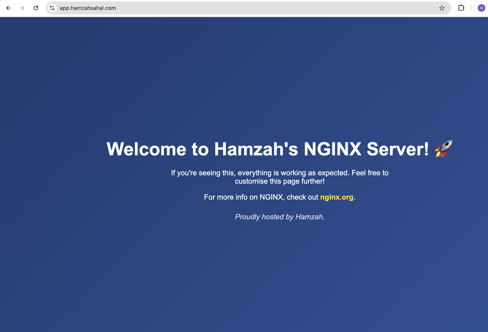
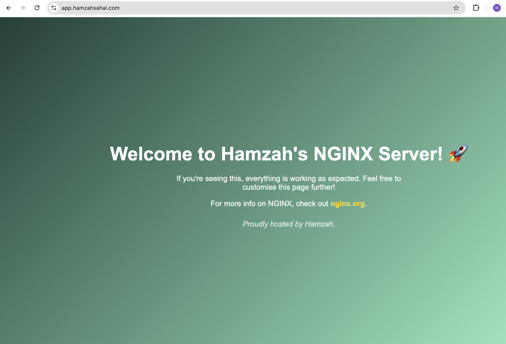

# High Availability Web Infrastructure with NGINX and SSL

## Table of Contents
- [Project Brief](#project-brief) 
- [Backend Infrastructure Configuration](#backend-infrastructure-configuration)
- [Reverse Proxy Configuration](#reverse-proxy-configuration)
- [Failover Reverse-Proxy Configuration](#failover-reverse-proxy-configuration)
- [Configuring the Main Traffic Instance ](#configuring-the-main-traffic-instance)
- [SSL Configuration](#ssl-configuration-1)
- [Setting Up a Status Page for Instance Health Monitoring](#setting-up-a-status-page-for-instance-health-monitoring)
- [Additional Security Measures](#additional-security-measures)

## Project Brief

### Objective:
To set up a highly available web infrastructure that includes multiple backend servers, reverse proxy (NGINX) for load balancing, failover configuration, SSL setup for both the app and status pages, and a status page to monitor server health.

### Steps:

#### **Domain & DNS Setup**
- **DNS Records Configuration**: Configure DNS records for the following subdomains:
    - **app.yourdomain.com**: This subdomain points to the main reverse proxy, which uses NGINX to distribute traffic across the backend servers.
    - **status.yourdomain.com**: This subdomain points to a status page showing the health of the backend and reverse proxy servers.

#### **Infrastructure Setup**
- **Backend Servers**: Deploy two VM instances running a simple web app (e.g., NGINX with different content on each).
- **Main Reverse Proxy**: Deploy a third VM as the main reverse proxy and load balancer. It uses NGINX to distribute traffic between the backend servers.
- **Failover Reverse Proxy**: Set up a secondary reverse proxy that automatically takes over if the primary reverse proxy goes down.
- **Main Traffic Instance**: A VM that manages reverse proxy failover, SSL configuration for both app and status subdomains, and hosts the status script.

#### **SSL Configuration**
- Secure both **app.yourdomain.com** and **status.yourdomain.com** with SSL certificates using **Let's Encrypt**.
- Enforce redirection from HTTP to HTTPS for both subdomains.

#### **Status Page & Health Checks**
- Deploy a status page on **status.yourdomain.com**, which shows:
  - The health of the backend servers.
  - The current status of the reverse proxy servers (main and backup).


## Backend Infrastructure Configuration

### Setting up the Instances

I set up three **t2.micro** instances on AWS, each running **NGINX**. These instances were configured using a **user-data** script that automates the installation and startup of NGINX upon instance launch. The script ensures that NGINX is installed, enabled, and running by executing the following commands:  

```bash
#!/bin/bash
sudo yum update -y
sudo sudo yum install -y nginx
sudo systemctl start nginx
sudo systemctl enable nginx
```

I renamed the instances based on their roles: **nginx-reverse-proxy** for handling incoming traffic, and **nginx** and **nginx-2** as backend servers to process application requests behind the proxy.

### Security Group Configuration

I adjusted the security groups for the instances to allow SSH (port 22) and HTTP (port 80) traffic.

### Customising Backend Server Layout (Optional)

As an optional setting, I modified the layout of each backend NGINX server by editing the `/usr/share/nginx/html/index.html` file. This change was made to visually differentiate the two servers (nginx and nginx-2) and confirm that the reverse proxy load balancer is correctly distributing traffic between them.

## Reverse Proxy Configuration  

### Setting Up the A-Record  
To begin, I configured an **A-Record** for the domain `app.hamzahsahal.com`, pointing it to the public IP of the **nginx-reverse-proxy** instance. This ensures that requests to `app.hamzahsahal.com` are directed to the reverse proxy server.  

### Editing the Reverse Configuration  
Next, I modified the **NGINX configuration file** located at `/etc/nginx/nginx.conf`.


The key changes included:  

- Defining an **upstream block** to list the backend servers (`nginx` and `nginx-2`).  
- Creating a **server block** to listen on port `80`, accepting HTTP requests for `app.hamzahsahal.com`.  
- Configuring a **proxy_pass directive** to forward requests to the backend servers.  

The updated configuration looked like this:  

```bash
http {
    upstream backend {
        server Backend-Server-1-IP;
        server Backend-Server-2-IP;
    }

    server {
        listen 80;
        server_name app.hamzahsahal.com;

        location / {
            proxy_pass http://backend;
        }
    }
}
```


### Testing HTTP Access

After saving the configuration, I restarted NGINX using:

```bash
sudo systemctl restart nginx
```

I then tested access to `app.hamzahsahal.com` over HTTP. By refreshing the page, I observed different layouts being served, confirming that the load balancing was working as expected and requests were being properly forwarded to the backend servers.





## Failover Reverse-Proxy Configuration

### Instance Creation

The `nginx-reverse-proxy-backup` instance acts as a failover solution, ensuring continued availability if the main reverse proxy becomes unreachable.

I used the user data method to automate the setup, following the same approach as with the [previous instances](#backend-infrastructure-configuration) for consistency and efficiency.

### Configuring the Backup Reverse Proxy  

For the `nginx-reverse-proxy-backup` instance, I configured the NGINX server block the same way as the primary reverse proxy. This included setting up the `server` block to listen for incoming traffic and defining an `upstream` block to route requests to the backend servers.

## Configuring the Main Traffic Instance  

The **main-traffic** instance is responsible for handling all incoming traffic for `app.hamzahsahal.com`. It forwards requests to the **primary reverse proxy**, ensuring smooth traffic distribution. If the primary reverse proxy becomes unreachable, the configuration includes a failover mechanism to automatically redirect traffic to the **backup reverse proxy**.  

The NGINX configuration for this instance requires:  

- An `upstream` block to define the **primary** and **backup** reverse proxies, ensuring failover functionality.  
- A `server` block listening on port `80` to enforce HTTPS by redirecting all HTTP requests to HTTPS.  
- A `server` block listening on port `443`, handling SSL termination and securely forwarding requests to the reverse proxies.  

This setup ensures that traffic is always routed through an available reverse proxy while maintaining secure HTTPS communication.  

### SSL Configuration

#### Installing Certbot  

To enable SSL on my **main-traffic** instance, I first installed **Certbot**. This was done using the following command:  

```bash
sudo yum install certbot python3-certbot-nginx
```

#### Stopping Nginx Before SSL Configuration

Before generating the SSL certificate, it's important to stop NGINX as Certbot needs to use port 80 to generate it. I stopped NGINX using:

```bash
sudo systemctl stop nginx
```

#### Generating the SSL Certificate

I then generated the SSL certificate using Certbot with the following command:

```bash
sudo certbot certonly --standalone -d app.hamzahsahal.com
```
The output will contain the location of the certificates.


### Configuring the .conf File for SSL and Reverse Proxy Redirection


Here’s the breakdown of how the NGINX configuration file is structured for the **main-traffic** instance:

1. **Upstream Block**  
   This block defines the reverse proxies and their failover behavior.

```bash
    upstream reverseproxy {
    # Main reverse proxy server
    server main-reverse-proxy-private-ip max_fails=3 fail_timeout=5s;

    # Backup reverse proxy server
    server backup-reverse-proxy-private-ip backup;
    }
```
**Purpose:**

- The upstream block defines two reverse proxy servers: the main reverse proxy and the backup reverse proxy.
- max_fails=3: This option indicates that if the main reverse proxy fails three times in a
row, it will be considered unavailable.
- fail_timeout=5s: If the main reverse proxy fails, the backup will be used after 5 seconds.

2. **HTTP Server Block for Redirection**

```bash 
server {
    listen 80;
    server_name app.hamzahsahal.com;

    location / {
        return 301 https://$host;
    }
}
```

**Purpose:**
This block listens on port 80 (HTTP) for incoming traffic to app.hamzahsahal.com.
If traffic is received, it sends a permanent redirect (HTTP 301) to the HTTPS version of the site, which ensures all traffic is encrypted.

3. **HTTPS Server Block for Secure Traffic Handling**

```bash
server {
    listen 443 ssl;
    server_name app.hamzahsahal.com;

    ssl_certificate /path/to/fullchain.pem;
    ssl_certificate_key /path/to/privkey.pem;

    location / {
        proxy_pass http://reverseproxy;
        }
    }
```
**Purpose:**
This block listens on port 443 (HTTPS) for secure traffic. The server is configured to use SSL certificates from Let's Encrypt.
Traffic is forwarded to the `reverseproxy`, which is defined in the upstream section. The `reverseproxy` refers to the main reverse proxy and its backup, ensuring high availability.

### Full .conf File Combined:

```bash
upstream reverseproxy {
    # Main reverse proxy server
    server main-reverse-proxy-private-ip max_fails=3 fail_timeout=5s;

    # Backup reverse proxy server
    server backup-reverse-proxy-private-ip backup;
}

# HTTP server block to redirect traffic to HTTPS
server {
    listen 80;
    server_name app.hamzahsahal.com;

    location / {
        return 301 https://$host;
    }
}

# HTTPS server block to handle secure traffic
server {
    listen 443 ssl;
    server_name app.hamzahsahal.com;

    ssl_certificate /path/to/fullchain.pem;
    ssl_certificate_key /path/to/privkey.pem;

    location / {
        proxy_pass http://reverseproxy;
    }
}
```

This configuration ensures that:

- HTTP traffic is automatically redirected to HTTPS.
- Secure traffic is forwarded to the appropriate reverse proxy server, with failover functionality in place.
- SSL certificates are properly configured for encryption.


### Adjusting Security Groups for HTTPS

To allow HTTPS traffic, I updated the security group for the nginx-reverse-proxy instance. Specifically, I allowed inbound traffic on port 443 (HTTPS) to ensure that external requests could securely access the reverse proxy.

### Updating the A Record to Point to the Public IP of the Main Traffic Instance

To ensure that traffic is directed to the correct server, I updated the A record for `app.hamzahsahal.com` to point to the public IP address of the main traffic instance.

### Testing SSL Configuration

After updating the configuration, I restarted Nginx to apply the changes:

```bash
sudo systemctl restart nginx
```

I then tested the SSL configuration by accessing `https://app.hamzahsahal.com.` The connection was secure, and the traffic was correctly routed to the backend servers, confirming that the SSL setup was working as expected.

Additionally, I tested the HTTP configuration by accessing `http://app.hamzahsahal.com`, which correctly redirected to the HTTPS version `(https://app.hamzahsahal.com)`, verifying that the HTTP to HTTPS redirection was functioning properly.

### Testing Backup Reverse Proxy Failover

To ensure the failover functionality was working as expected, I tested the backup reverse proxy by temporarily shutting down the main reverse proxy. During this test, I verified that traffic was automatically redirected to the backup reverse proxy without interruption. The backup reverse proxy successfully handled the requests and forwarded them to the backend servers, confirming the failover mechanism was properly configured and operational.


## Setting Up a Status Page for Instance Health Monitoring

To keep track of the health of both the reverse proxy and backend servers, I set up a status page that checks and displays their online/offline status. This page provides a quick and easy way to monitor the operational state of these critical components. I'll go into more detail on how I configured the checks and designed the page in the following sections, but for now, this status page serves as a key tool for ensuring that the infrastructure is running smoothly.

### Script Creation to Check the Status

The script I created checks the health status of both the reverse proxy and backend servers. It defines two arrays: one for the reverse proxy servers and one for the backend servers. For each server, the script attempts to make a request using `curl` to determine if the server is online by checking for an `HTTP 200 OK`response.

The results are then displayed in an HTML format, with the server name and its status (either "ONLINE" or "OFFLINE") clearly presented. The status page is styled with basic CSS to make it more readable and visually appealing.

The script outputs the status information for both sets of servers into an HTML file, which is saved in the NGINX web directory, so it can be accessed easily via a web browser. This provides a quick way to monitor the health of the infrastructure at a glance.


```bash
#!/bin/bash
REVERSE_PROXY_SERVERS=("Main Reverse Proxy IP" "Backup Reverse Proxy IP")
REVERSE_PROXY_NAMES=("Main Reverse Proxy" "Backup Reverse Proxy")

# Define the backend (backup) servers
BACKEND_SERVERS=("Backend Server 1 IP " "Backend Server 2 IP")
BACKEND_NAMES=("Backend Server 1" "Backend Server 2")

STATUS_FILE="/usr/share/nginx/html/status.html"
ACTIVE_SERVERS=()

# Function to check the status of servers
check_status() {
    SERVER=$1
    SERVER_NAME=$2

    # Attempt to curl the server and check for a successful response
    RESPONSE=$(curl -Is http://$SERVER | head -n 1)

    if [[ "$RESPONSE" =~ "HTTP/1.1 200 OK" ]]; then
        echo "$SERVER_NAME is <b style='color:green;'>ONLINE</b> - The server is operating normally."
    else
        echo "$SERVER_NAME is <b style='color:red;'>OFFLINE</b> - The server is currently unreachable. Please investigate."
    fi
}

# Write the status to the HTML file
{
    echo "<html>"
    echo "<head><title>Server Status</title>"
    echo "<style> body { font-family: Arial, sans-serif; background-color: #f4f4f9; color: #333; } "
    echo "h1 { color: #2c3e50; } p { font-size: 18px; margin: 10px 0; } "
    echo ".online { color: green; } .offline { color: red; } </style></head>"
    echo "<body>"
    echo "<h1>System Status Overview</h1>"

    # Check Reverse Proxy Servers
    echo "<h2>Reverse Proxy Status</h2>"
    for i in "${!REVERSE_PROXY_SERVERS[@]}"
    do
        SERVER="${REVERSE_PROXY_SERVERS[$i]}"
        SERVER_NAME="${REVERSE_PROXY_NAMES[$i]}"
        echo "<p>$(check_status $SERVER "$SERVER_NAME")</p>"
    done

    echo "<hr>"

    # Check Backend Servers
    echo "<h2>Backend Server Status</h2>"
    for i in "${!BACKEND_SERVERS[@]}"
    do
        SERVER="${BACKEND_SERVERS[$i]}"
        SERVER_NAME="${BACKEND_NAMES[$i]}"
        echo "<p>$(check_status $SERVER "$SERVER_NAME")</p>"
    done

    echo "<hr>"
    echo "<footer><p>Page generated on $(date). All servers are being monitored to ensure system reliability.</p></footer>"
    echo "</body>"
    echo "</html>"
} > "$STATUS_FILE"
```

### Setting Up a Cron Job to Run the Status Script Every Minute

To automate the execution of the status page script, we can set up a cron job to run the script every minute. This ensures that the status page is updated in real-time, providing an accurate view of the system's health.

#### Method to Install Cron

1. First, ensure that the `cron` package is installed on your instance. If it's not installed, you can do so by running the following command:

```bash
    sudo yum install cronie
```

2. After installation, enable and start the `cron` service:

```bash
    sudo systemctl enable crond
    sudo systemctl start crond
```

3. Check the status of the `cron` service to make sure it is running:

```bash
    sudo systemctl status crond
```

#### Creating the Cron Job

1. Open the crontab configuration file by running:

```bash
    crontab -e
```

2. In the crontab file, add the following line to run the server status script every minute:

```bash
    * * * * * /path/to/your/script
```

- The `* * * * *` part means the cron job will run every minute of every hour, every day, every month, and every weekday.
- Replace `/path/to/your/script` with the correct path to your status script.

3. Save and exit the crontab file. The cron job is now set to execute the script every minute.

#### Verifying the Cron Job

To confirm that the cron job has been successfully added, you can check the list of scheduled cron jobs by running:

```bash
crontab -l
```

### Making the Script Executable with the `chmod` Command

Before the cron job can run the script, you need to ensure that the script has the proper executable permissions. This is done using the `chmod` command.

#### Steps to Make the Script Executable

1. To grant executable permissions to the status script, run the following command:

```bash
    chmod +x /path/to/your/script
```

  - Replace `/path/to/your/script` with the correct path to your script.

2. To verify that the script is now executable, you can check the file permissions using the `ls` command:

```bash
    ls -l /path/to/your/script
```

   - The output should show that the script has executable permissions, indicated by an `x` in the permission string (e.g., `-rwxr-xr-x`).

By ensuring the script is executable, it will be ready to run automatically via the cron job or manually as needed.

### Adding the A Record for `status.hamzahsahal.com` on Cloudflare

You will need to add an A record for `status.hamzahsahal.com` in Cloudflare, pointing to the public IP of the main traffic instance.


### Creating the SSL Certificate for `status.hamzahsahal.com`

To create the SSL certificate for `status.hamzahsahal.com`, use the [same method](#ssl-configuration-1) as for the `app.hamzahsahal.com` domain, but with the appropriate domain name.

### Editing the Conf File for the Main Traffic Server

You will need to edit the NGINX configuration file for the main traffic server to point to the HTML file that the status script outputs. Use the following server block:

```bash
server {
    listen 443 ssl;
    server_name status.hamzahsahal.com;

    ssl_certificate /path/to/fullchain.pem;
    ssl_certificate_key path/to/privkey.pem;

    location / {
        root /usr/share/nginx/html;
        index status.html;
    }
}
```

### Testing the Status Page

Once you've made the necessary changes, test the setup by visiting `https://status.hamzahsahal.com`. You should see the status page displaying the current status of both the reverse proxy and backend servers, along with their respective online or offline status. If everything is configured correctly, the page should be updated every minute based on the cron job you've set up.

Below is an example of how it looked when the `main reverse proxy` was offline.


## Additional Security Measures  

To enhance security and ensure only necessary traffic flows between instances, **Security Groups** can be configured with strict **inbound rules**. Here’s how you can lock down access:  

### 1. Restrict Public Access  
- Allow **only HTTP (80) and HTTPS (443) traffic** from the public internet **to the main traffic instance**.  
 

### 2. Secure Internal Communication  
- Only allow traffic **from the main traffic instance** to the reverse proxy instances on **port 80/443**.  
- Only allow traffic **from the reverse proxies** to the backend servers on **port 80/443**.  

### 3. Lock Down SSH Access  
- Restrict **SSH (port 22) access** to specific IPs (e.g., your office or VPN).  


### 4. Implement NACLs for an Extra Layer of Security  
- Use **Network ACLs (NACLs)** to enforce rules at the subnet level, blocking unwanted traffic before it even reaches the security group.  
- Define **strict allow rules** for communication between different tiers (main traffic instance → reverse proxies → backend servers).  

By enforcing these rules, the setup remains locked down, preventing unauthorised access while still ensuring necessary communication between components.


